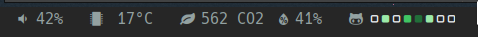

As a [solo founder], I find that it can be difficult to make constant incremental progress on my projects. My output tends to be bursty, which can lead to various issues:

- burnout via compressing output into short periods of intense work
- incentivizing procrastination
- missing deadlines when major issues are found too late

So, in 2024 I've started investing in changing my environment and lifestyle to encourage incremental and maintainable progress.

With this in mind, I recently added my GitHub contributions to my [Polybar] configuration with the goal of providing a constant reminder to show some progress as often as possible. This is by no means a perfect metric, but it's a fun metric for me - and the more fun something is the more likely I'll do it.

Here is what it looks like! This is displayed along the bottom of my screen at all times.



From left to right, the modules I use are:
- Speaker volume
- CPU temperature
- CO2 monitoring in my office using [co2.click]
- My GitHub contributions in the last week (and the topic of this blog post!)

## GitHub contributions?

Here is my [GitHub contribution graph][profile] from January 2023 to January 2024:


The graph shows a box for every day in the selected time range and colors the box based on the number of "contributions" you made that day. Contributions are [calculated][contributions-docs] by summing various metrics including:

- Issues, pull requests, and discussions created
- Commits to the default or gh-pages branches (but not in forks)

Like most (all?) developer metrics, GitHub contributions are easy to game and **should not be used to compare developers or measure productivity**. Here are some fun examples of gaming GitHub contribution graphs:

 - [gitfiti]: Graffiti in your GitHub contributions graph
 - [github-activity-generator]: generate a fake contributions graph


## Adding GitHub contributions to Polybar

> **tldr;** The code is pretty simple and makes use of the excellent [GitHub CLI]. Here is the final [source-code] and [config].

To start, I noticed that you can run arbitrary queries against GitHub's [GraphQL API] using the CLI command `gh api graphql`:

```bash
$ gh api graphql -f query="{ viewer { login } }"
{
  "data": {
    "viewer": {
      "login": "carlsverre"
    }
  }
}
```

This is convenient, because the data powering the contributions graph is available directly using this GraphQL query:

```graphql
{
  viewer {
    contributionsCollection(from:"${FROM}", to:"${TO}") {
      contributionCalendar {
        weeks {
          contributionDays {
            contributionCount
            color
          }
        }
      }
    }
  }
}
```

Which returns the JSON result:

```json
{
  "data": {
    "viewer": {
      "contributionsCollection": {
        "contributionCalendar": {
          "weeks": [
            {
              "contributionDays": [
                {
                  "contributionCount": 1,
                  "color": "#9be9a8"
                },
                // ...
```

Note that we can request both the number of contributions and the color GitHub would use to render the day in the official profile graph.

Combining this output with a [jq] pipeline and some bash magic leads to this ~beautiful~scrappy gem of code:

```bash
echo "${DATA}" | jq -r '.data.viewer.contributionsCollection.contributionCalendar.weeks[].contributionDays[] | [.color, .contributionCount] | @tsv' | while read -r color contributionCount; do
    if [[ $contributionCount -gt 0 ]]; then
        echo -n "%{F${color}}${COMPLETE_ICON}%{F-}%{O2}"
    else
        echo -n "%{F${color}}${INCOMPLETE_ICON}%{F-}%{O2}"
    fi
done
```

Which, if you squint a bit, iterates through each `(color, contributionCount)` and echos it out in a format accepted by Polybar which looks like this:


Check out the full [source-code] for all the little details like rendering icons, handling the internet being disconnected and some date math.

## Refresh on click

But we aren't done yet! To maximize gamification, I need to ensure I get a dopamine hit very soon after I take an action I want to reinforce. So, we want the graph to update quickly after a relevant contribution is posted to my profile.

The simple solution is to aggressively refresh the script. Unfortunately, not only does this needlessly waste resources, it also might trigger rate-limits on the GitHub API.

Another solution is to hook into the git CLI to trigger a refresh after commits are pushed to GitHub. But this solution wouldn't track other contribution sources like issues and discussions.

So, the solution I decided on was to refresh the script on click.

Conveniently, it's possible to tell Polybar to intercept mouse events, allowing modules to be interactive. There are a number of ways to do this, but most of them rely on transforming mouse events into signals and sending them to the script - thus requiring the script to be long-lived.

Making the script long-lived and handling signals was more complex than I had in mind, so I hunted for an alternative solution.

The solution I ended up with is to leverage the built-in `custom/ipc` module to run my script whenever the module is clicked. Then, to enable periodic refresh I added a regular `custom/script` module that uses the `polybar-msg` command to periodically trigger the `ipc` module. This feels like an abuse of Polybar, but seems to work reliably and is simpler than dealing with long-running scripts and signals.

Here is what it looks like in a Polybar [config] file:

```ini
[module/gh-contrib]
type = custom/ipc
hook-0 = ~/.config/polybar/script/gh-contrib.sh
click-left = "#gh-contrib.hook.0"

[module/gh-contrib-refresh]
type = custom/script
exec = polybar-msg action "#gh-contrib.hook.0" >/dev/null
interval = 300
```

## Incrementally improving incremental improvement

The goal of this project was to make a small change to my mindset whenever I sit down to work. And honestly, it is working! I've noticed that since I built this tool roughly three weeks ago I've started to look forward to making my first public contribution every day. Even on days that I don't end up following through, the psychological benefit is there and helps me to focus.

Finally, projects like these are fantastic ways to flex your scrappy development muscles. I believe it took me roughly an hour to get this working from conception to production. There is an immense satisfaction of creating something quickly that you end up using every day! So, if there is any tweak to your environment or lifestyle that's on your mind - consider just doing it. You'll be glad you did!

[source-code]: https://github.com/carlsverre/dotfiles/blob/8fc4c877480c3137764520ad62ab9f1b47463a71/config/polybar/script/gh-contrib.sh
[config]: https://github.com/carlsverre/dotfiles/blob/8fc4c877480c3137764520ad62ab9f1b47463a71/config/polybar/config.ini#L83
[Polybar]: https://github.com/polybar/polybar
[GitHub CLI]: https://cli.github.com/
[profile]: https://github.com/carlsverre
[contributions-docs]: https://docs.github.com/en/account-and-profile/setting-up-and-managing-your-github-profile/managing-contribution-settings-on-your-profile/why-are-my-contributions-not-showing-up-on-my-profile
[github-activity-generator]: https://github.com/Shpota/github-activity-generator
[gitfiti]: https://github.com/gelstudios/gitfiti
[co2.click]: https://co2.click/
[GraphQL API]: https://docs.github.com/en/graphql/overview/explorer
[jq]: https://github.com/jqlang/jq
[solo founder]: https://sqlsync.dev