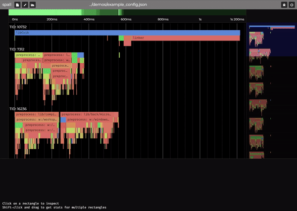
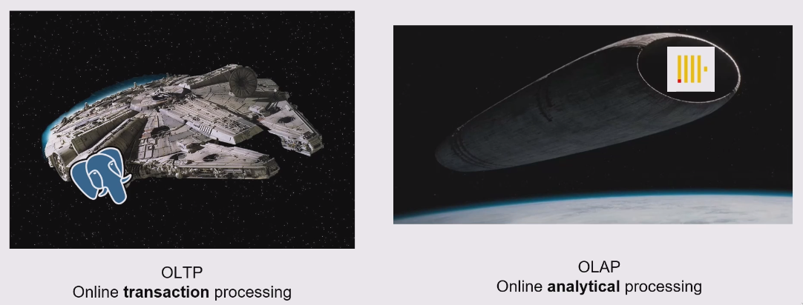

Last week I attended Handmade Seattle 2023. If you haven't heard about this conference or the Handmade movement, it's a community of low-level programmers with a passion for understanding how things work and doing things from scratch. It was originally inspired by [Handmade Hero], in which Casey Muratori creates a video game starting from a [WinMain entry point][hh-start].

$$
L = \frac{1}{2} \rho v^2 S C_L
$$

Handmade Seattle is part of [Handmade Cities], an organization run by Abner Coimbre. I met Abner earlier this year at [Software You Can Love][sycl] in Vancouver, another conference focused on systems programming and the craft of high quality software. Abner also runs the [Handmade Network] which seems to be the primary way to engage with the Handmade community.

[Handmade Cities]: https://handmadecities.com
[Handmade Network]: https://handmade.network/
[Handmade Hero]: https://handmadehero.org/
[hh-start]: https://youtu.be/Ee3EtYb8d1o?si=2YLfD524Qs0vEgZ3&t=1013
[sycl]: https://softwareyoucanlove.ca/

## TLDR

- I plan to attend future Handmade events
- It's a great place to meet system programmers
- The demos and talks are impressive, and generally push limits
- Participants are very curious and not afraid to crack open the source, or even disassemble things to learn how they work

> The rest of this post will focus on particular projects I found interesting. Enjoy!

## Tilde

[Yasser Arguelles] is building a compiler backend called [Tilde] which is one component of their modern C11 compiler named [Cuik]. Cuik is attempting to be a viable alternative to GCC, MSVC, and LLVM. The Handmade community is particularly excited about these projects as they may be able to replace LLVM usage in some projects (LLVM can be quite heavy, Tilde is designed to be very light).

> [Watch Yasser's Tilde demo here][tilde-talk]

This project also introduced me to the Sea of Nodes intermediate representation (IR) for compilers. This is not an area I specialize in, so take what I'm about to say with a grain of salt. In my limited research, Sea of Nodes represents the program as a graph where nodes are operations or values, and edges represent dependencies. By focusing on data and control dependencies, it seems that Sea of Nodes may enable more optimization opportunities and aggressive reordering without compromising correctness.

It will be interesting to follow this project, especially if it ends up being adopted as an LLVM replacement in projects like [Zig] or [Odin]. I also hope that the author shares some content in the future. You can [follow Yasser Arguelles on Mastodon here][yasser-mastodon].

[Yasser Arguelles]: https://www.linkedin.com/in/yasser-arguelles-365436250/
[Cuik]: https://github.com/RealNeGate/Cuik
[Tilde]: https://github.com/RealNeGate/Cuik/tree/master/tb
[Zig]: https://ziglang.org/
[yasser-mastodon]: https://mastodon.social/@negate
[tilde-talk]: https://vimeo.com/887510264/798b29233f

## Odin

Speaking of [Odin], I also learned about Odin at Handmade Seattle. Odin is a general-purpose programming language that [takes inspiration from][odin-influences] Pascal, C, Go, Oberon-2, Newsqueak, and GLSL. It's oriented towards low-level programming with ergonomic features that make it easier and safer to use.

> [Watch a fireside chat between Odin's author, Ginger Bill, and Abner Coimbre!][odin-talk]

Among Odin's [many features][odin-features], I'd like to highlight the Context system, custom allocators, and array programming.

Odin's Context system is a [bag of mutable values][odin-context] that are implicitly passed around to every procedure. It seems that this is the recommended way to override the allocator and logger, as well as pass around user data. It seems to be an ok solution to allocator/logging management, as those are often implicit in most languages - however I'm not a huge fan of passing untyped user data implicitly via a pointer. Perhaps there is a way to constrain which types you can store in the `user_ptr` field or otherwise add safety to it at compile time.

The Context system does enable a fantastic feature, which is custom allocators. When working on high-performance software, it's often very useful to leverage custom allocators. For example, you might want to use a slab allocator to simplify memory management during a short section of code.

Array programming is another interesting feature. Specifically, I'd like to call out Odin's native support for [Structure of Array (SoA)][odin-soa] and similar transformations. It's cool to see the language transparently convert logical and physical data representations, while also enabling easier vectorization.

```cpp
Vector3 :: struct {x, y, z: f32}

// declare an array of two Vector3's
N :: 2
v_soa: #soa[N]Vector3

// we can access them as if they were an array of structs
v_soa[0].x = 1
v_soa[0].y = 4
v_soa[0].z = 9

// or as a struct of arrays
v_soa.x[0] = 1
v_soa.y[0] = 4
v_soa.z[0] = 9
```

Finally, Odin has a native [matrix representation][odin-matrix] as well, which can dramatically simplify certain kinds of math heavy code. This probably came in handy while the author, Bill Hall (aka Ginger Bill), worked on graphics programming at [JangaFX].

```cpp
a := matrix[2, 3]f32{
  2, 3, 1,
  4, 5, 0,
}

b := matrix[3, 2]f32{
  1, 2,
  3, 4,
  5, 6,
}

// Supports many native matrix ops
// such as multiplication
c := a * b
#assert(type_of(c) == matrix[2, 2]f32)
fmt.tprintln("c = a * b", c)
```

Overall, I think I might look at Odin if I were doing some low-level graphics or game programming! Very cool!

[Odin]: https://odin-lang.org/
[odin-influences]: https://odin-lang.org/docs/faq/#what-have-been-the-major-influences-in-the-languages-design
[odin-features]: https://odin-lang.org/docs/faq/#what-does-odin-offer-over-other-languages
[odin-context]: https://github.com/odin-lang/Odin/blob/f79efd43e44ae74bfae098d49bf9c5b2876eda5d/core/runtime/core.odin#L376
[odin-soa]: https://odin-lang.org/docs/overview/#soa-data-types
[odin-matrix]: https://odin-lang.org/docs/overview/#matrix-type
[odin-talk]: https://vimeo.com/887533603/9222544305
[JangaFX]: https://jangafx.com/

## Whitebox

[Whitebox] is a debugger unlike anything I've seen before. Honestly, it's sorta hard to explain, so just go **[watch the demo][whitebox-talk]**.

...done? No seriously, go watch it, it's just 5 mins!

Ok so that was nuts right? Seeing every value of every local variable over time is such a powerful and simple idea - I can't believe this is the first time I've seen it!

So why isn't Whitebox everywhere? Well, at least one of the reasons is that they have to build a kind of custom compiler for each language they support. For now, only C and C++ is supported, with more languages in the pipeline.

Personally, I'm ready to buy as soon as they have Rust support! Exciting to see innovation happening in the debugger space!

[Whitebox]: https://whitebox.systems/
[whitebox-talk]: https://vimeo.com/887510192/7488c1c6a0

## Spall



Flame Graphs are awesome, and I have used them often throughout my career. Whether it was profiling query execution performance at SingleStore or debugging why my React app isn't hitting 60 FPS, Flame Graphs have been a lifesaver.

[Spall] is a flame graph profiler that's designed to be used on the web and natively on your computer. Its rough goal is to provide a similar user experience to amazing tools like the Chrome Profiler while also working well for native apps.

If you're interested in more previews, I recommend checking out the [Spall devlog]. This is another project I'm considering using for things like [SQLSync].

[Spall]: https://gravitymoth.com/spall/
[Spall devlog]: https://handmade.network/p/333/spall/
[SQLSync]: https://sqlsync.dev

## Recommended talks

In addition to the projects highlighted above, here are some other talks that I found interesting or exciting:

### [SQL's Inner Workings with Nikita Lapkov][sql-iw]

In this talk, Nikita covers the key differences between OLTP and OLAP optimized storage systems in databases. In addition to an excellent overview of the topic, he also included this amazing comparison:



[sql-iw]: https://vimeo.com/888147574/414952f8d8

### [High-level is the goal with Ben Visness][ben-hl]

This talk is a fantastic discussion of low-level versus high-level software, specifically oriented towards the Handmade community. I especially enjoyed his usage of the [Truckla] story at the beginning of the talk.

> Quick aside: I highly recommend watching [Simone Giertz's videos][simone-videos], especially some of her older stuff.

[ben-hl]: https://vimeo.com/888144904/41ea23bd45
[Truckla]: https://www.youtube.com/watch?v=R35gWBtLCYg
[simone-videos]: https://www.youtube.com/@simonegiertz/videos

### [Disassembling Imposter Syndrome with Loris Cro][loris-talk]

Loris closed the conference off with this fantastic talk on imposter syndrome. Imposter syndrome is a topic that comes up a ton in our industry, and I'm happy to see it show up and be discussed during conferences like Handmade Seattle. I especially like the section of the talk on Fight vs Flight people in communities. Watch this talk!

[loris-talk]: https://vimeo.com/888147720/f0182acf4e

### [Eon: An Amiga 500 Demo with Andreas Fredriksson][eon-talk]

Whether you've seen demoscene videos before, I guarantee you'll find this one impressive. The talk starts with a five-minute demo that runs on native Amiga 500 hardware. Afterwards, Andreas goes into the process of creating this masterpiece of art and engineering that took him and his team four years to finish.

If you're interested in learning more about the nitty-gritty details [check out the team's devlog][eon-blog].

And if you're inclined to run Eon yourself, you can [get it from Pouet][eon-pouet].

[eon-talk]: https://vimeo.com/887527796/c9132ed6bc
[eon-blog]: https://tbl.nu/posts/
[eon-pouet]: https://www.pouet.net/prod.php?which=81094

## That's all folks!

I'm forcing myself to just release this rather than sitting on it forever. Hopefully I didn't make too many mistakes or typos or grammar issues - but if I did, please feel free to leave a comment below (javascript required). Now to plan my next post so this blog doesn't become yet another "one post and done" tech blogs we have seen so much of. Maybe I'll talk about how I built this blog. That's unique right?

Thanks for reading!

~/Carl
